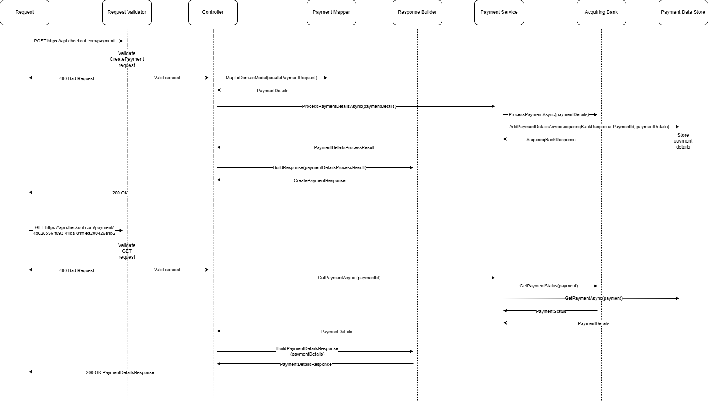

# Payment Gateway API

## Purpose
The Payment Gateway API allows a merchant to offer a way for their shoppers to pay for their product. The API also allows retrieving details of previously made payments.

**The documentation is available on [Wiki](https://github.com/VPaskevicus/payment-gateway-api/wiki) pages.**

## Available Endpoints
- POST /register - register a user with a username and password
- POST /authenticate - get Bearer token based on username and password
- POST /payment - create a payment request
- GET /payment/{PaymentId} - get payment status and transaction details

In order to process the payment request, the merchant (User) should first register using https://localhost:7272/register endpoint.

After user details are stored in the user data store, the user should be able to get a Bearer authentication token using https://localhost:7272/authenticate endpoint.

Use the retrieved Bearer token to access payment endpoints.

To call API endpoints, refer to the [API contracts](https://github.com/VPaskevicus/payment-gateway-api/wiki/API-Contracts) documentation.

## Code Architecture
We have a .NET Core API project `Checkout.Payment.Gateway.Api` which follows the following code-level hierarchy and flow.
- **AuthenticationMiddleware**: Approves or denies a request to access the payment controller
    - **RequestValidator**: Validates request parameters (mandatory fields)
        - **Controller**: Performs request execution
            - **RequestMapper**: Mapps contract request to the domain model
            - **PaymentService**: Performs payment logic for storing, querying, and forwarding payment requests to acquiring bank
                - **AcquiringBank**: Performs the client call to acquiring bank and mapps retrieved response to the domain model 
                - **PaymentDetailsRepository**: Performs data store operations for payment requests
            - **UserRepository**: Performs data store operations for users
            - **AuthenticationTokenGenerator**: Generates Bearer token based on given username and password
            - **ResponseBuilder**: Builds response for a consumer

## Request pipeline diagram                


## Run Payment Gateway API locally
The application will run using an in-memory data store and a fake acquiring bank that will simulate the process of a payment request and response. 

Using the IAcquiringBank interface, we can implement the integration part of the application that will contain the client-related code. The real implementation class can then be swapped with the current temporary fake when going to the production environment.

For testing purposes, make sure that the application uses InMemoryDataStore and FakeAcquiringBank in <b>Program.cs</b> class

```
builder.Services.AddSingleton<IPaymentDetailsRepository, InMemoryPaymentDetailsDataStore>();
builder.Services.AddSingleton<IUserRepository, InMemoryUserDataStore>();
builder.Services.AddSingleton<IAcquiringBank, FakeAcquiringBank>();
```
### Run using Visual Studio
 - Download the [Visual Studio](https://visualstudio.microsoft.com/thank-you-downloading-visual-studio/?sku=Community&channel=Release&version=VS2022&source=VSLandingPage&cid=2030&workload=dotnet-dotnetwebcloud&passive=false#dotnet) 
 - Build and run the project using Visual Studio
 - The API should be accessible on https://localhost:7272 or http://localhost:5012

### Run using Docker
 - Install docker [Docker Desktop on Windows](https://docs.docker.com/desktop/install/windows-install/)
 - Open Windows PowerShell
 - Check the version of a docker installed by running <code>docker --version</code>
 - Navigate to payment gateway api code repositorey <code>[path to repository]/payment-gateway-api</code>
 - Build the docker image <code>docker build -t payment-gateway-api:v1 .</code>
 - Run docker image mapping application port 5000 <code>docker run -d -e ASPNETCORE_ENVIRONMENT=Development -p 5000:80 payment-gateway-api:v1</code>
 - The application can be accessed on <code>http://localhost:5000/swagger/index.html</code>